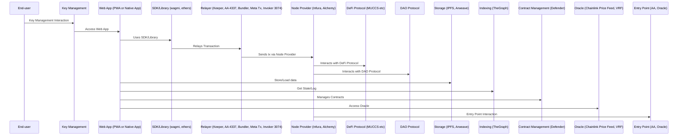

# Simple DAO

## Diagram

```mermaid
sequenceDiagram
    participant EndUser as End-user
    participant KeyMgmt as Key Management
    participant WebApp as Web App (PWA or Native App)
    participant SDK as SDK/Library (wagmi, ethers)
    participant Relayer as Relayer (Keeper, AA 4337, Bundler, Meta Tx, Invoker 3074)
    participant Node as Node Provider (Infura, Alchemy)
    participant DeFi as DeFi Protocol (MUCCS etc)
    participant DAO as DAO Protocol
    participant Storage as Storage (IPFS, Arweave)
    participant Indexing as Indexing (TheGraph)
    participant ContractMgmt as Contract Management (Defender)
    participant Oracle as Oracle (Chainlink Price Feed, VRF)
    participant EntryPoint as Entry Point (AA, Oracle)

    EndUser ->> KeyMgmt: Key Management Interaction
    KeyMgmt ->> WebApp: Access Web App
    WebApp ->> SDK: Uses SDK/Library
    SDK ->> Relayer: Relays Transaction
    Relayer ->> Node: Sends tx via Node Provider
    Node ->> DeFi: Interacts with DeFi Protocol
    Node ->> DAO: Interacts with DAO Protocol
    WebApp ->> Storage: Store/Load data
    WebApp ->> Indexing: Get State/Log
    WebApp ->> ContractMgmt: Manages Contracts
    WebApp ->> Oracle: Access Oracle
    Node ->> EntryPoint: Entry Point Interaction
```

メタコントラクトを使うと共通のスキーマを持ったストレージ変数を使い回すことができる。
